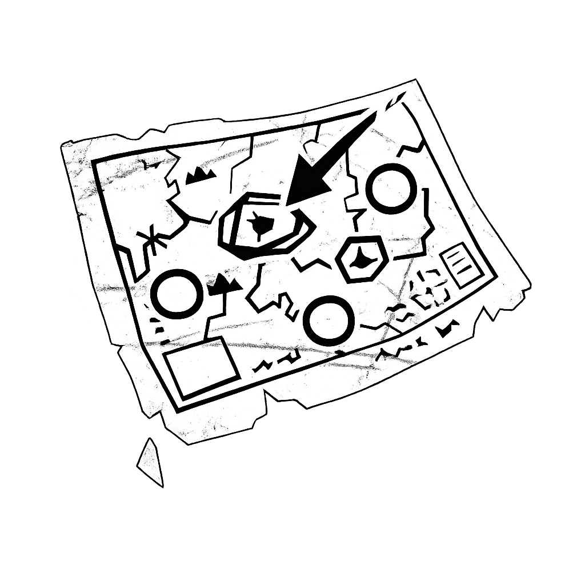

<p align="center">
  
</p>

<h1 align="center">DBD Map Overlay</h1>

<p align="center">
  <a href="https://github.com/LucaFontanot/dbd-map-overlay/releases"></a>
  <a href="https://github.com/LucaFontanot/dbd-map-overlay/releases/latest"></a>
  <a href="https://github.com/LucaFontanot/dbd-map-overlay/releases/latest"></a>
  <a href="./LICENSE"></a>
</p>

<p align="center">
  A lightweight <strong>Dead by Daylight</strong> overlay that instantly shows you the full minimap for the current match, no more guessing or wasting precious seconds explaining your position to teammates.
</p>

<p align="center">
  <a href="https://steamcommunity.com/sharedfiles/filedetails/?id=3014263156">📖 Tutorial</a> · 
  <a href="https://dbdmap.lucaservers.com">🌐 Official Site</a> · 
  <a href="./CHANGELOG.md">📋 Changelog</a> · 
  <a href="./CREDITS.md">🎨 Credits</a>
</p>

---

## ✨ Features

- 🗺️ **Hundreds of maps** organized by creator and realm from <a href='CREDITS.md'>community artists.</a>
- 🤖 **Automatic map detection**: OCR-powered system reads the game screen and switches the overlay automatically (see below)
- 🖥️ **OBS-ready overlay window**: a dedicated transparent window optimised for capture cards and streaming software
- 🎮 **Stream Deck support**: generate Stream Controller config files and browse maps straight from your hardware deck
- ⌨️ **Custom hotkeys**: bind any key combination to flip through maps hands-free
- 🌍 **15 languages**: full map-name localization (EN, DE, FR, ES, IT, PT, RU, PL, TR, JA, KO, ZH-Hans, ZH-Hant, TH)
- 🖼️ **Custom maps**: import your own minimap images alongside the built-in ones
- 🔄 **Auto-update**: the app keeps itself up to date via GitHub Releases
- 🐧 **Windows & Linux**: native builds for both platforms (Wayland compatible)

---

## 🤖 Automatic Map Detection

Starting from **v1.6.0**, the overlay can detect which map you are loading into and switch automatically, no hotkey required.

### How it works

The detector periodically takes a screenshot of the Dead by Daylight window and runs **multi-language OCR** (via [tesseract.js](https://github.com/naptha/tesseract.js)) on the area where the game displays the **Realm / Map** name during the loading screen.

Language packs (~45 MB total, fast LSTM model) are downloaded once and stored locally, no data ever leaves your machine.

## 🚀 Getting Started

### Download

Grab the latest installer or portable build from the [**Releases**](https://github.com/LucaFontanot/dbd-map-overlay/releases/latest) page:

| Platform | Format |
|----------|--------|
| Windows | `.exe` installer / portable |
| Linux | `.AppImage` / `.deb` / `.rpm` |

### Build from source

```bash
git clone https://github.com/LucaFontanot/dbd-map-overlay.git
cd dbd-map-overlay
npm install
npm run build        # builds for both Windows and Linux
# or
npm run build:win    # Windows only
npm run build:linux  # Linux only
```

The output will be in the `/dist` directory.

---

## ⌨️ Command-line Usage

You can send a map command to an **already-running** instance of the app:

```bash
dbd-map-overlay show-map="Creator/Realm/MapName"
```

- If the app is **not running**, it starts normally without applying the map.
- If the app **is running**, the overlay switches to the requested map in the background.
- If **no map argument** is passed and the app is already open, a popup will notify you.

### Map key format

```
Creator/Realm/MapName
```

**Example:**
```bash
dbd-map-overlay show-map="SamoelColt/The Macmillan Estate/Suffocation Pit"
```

> - Keys are **case-insensitive**
> - File extensions are **not required**
> - If the exact map name isn't found, the **closest match** is used automatically

---

## 🎛️ Stream Deck Support

The app includes a config generator for [Stream Controller](https://github.com/StreamController/StreamController), letting you control maps directly from your Stream Deck hardware.

**Requirements:**
- Linux
- [Stream Controller](https://github.com/StreamController/StreamController) installed
- Font Awesome plugin installed in Stream Controller

**Setup:**
1. Open the app → **Settings → Stream Deck**
2. Select your Stream Controller installation type:
   - **Flatpak**: uses default Flatpak paths automatically
   - **Manual**: choose your own output directory
3. Click **Create Configs** and choose:
   - Number of buttons on your Stream Deck (6, 15, 32, …)
   - Command prefix (default: `dbd-map-tool`)
   - Map creator whose maps you want to use
4. The app generates Stream Controller configs with:
   - Main pages listing all realms for the selected creator
   - Individual realm pages with all maps
   - Navigation buttons with automatic pagination
   - Smart multi-line button labels for long map names

---

## 🤝 Contributing

Want to add or update maps? Follow the [**Contributing Guide**](./CONTRIBUTE.md). Keeping the map library up to date is the most impactful way to help the project.

## 🎨 Credits

This project wouldn't exist without the talented artists who created the minimap illustrations. Please [**check the credits**](./CREDITS.md) and show them some love.

## 📋 Changelog

See [**CHANGELOG.md**](./CHANGELOG.md) for a full history of changes.

## 📜 Terms of Service

By using this software you agree to the [**Terms of Service and Privacy Policy**](./TERMS%20AND%20PRIVACY.md).

## ⚖️ License

Licensed under the [**Apache 2.0 License**](./LICENSE).  
You are free to use, modify, and distribute this software as long as you credit the original author and don't hold them liable. Provided as-is, without any warranty.

> **Not affiliated with Dead by Daylight, Behaviour Interactive, or any of their partners.**
